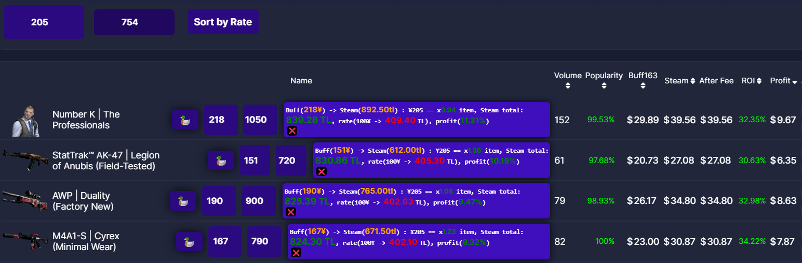

# Trading Assistant Extension

A Chromium based extension that enhances the CS:GO skin trading experience by providing powerful comparison tools between Buff (Chinese trading platform) and Steam Market prices. This project was developed as a hobby project when i was a high school student (in 2023) to create myself a trading assistant.

## Features

### Price Empire Comparison Page
- Dynamic input fields for balance calculations
- Automatic currency conversion between Buff (¥) and Steam (TL)
- Sort items by profit rate
- Quick reload functionality
- Real-time profit calculations

### Steam Market Page
- Custom navigation bar with minimize/maximize controls
- Profit percentage calculator
  - Input fields for FROM and TO prices
  - Real-time profit percentage display
- Bulk price calculator
  - Input field for item count
  - Automatic price summation
  - Rate calculation per item
- Ad removal functionality

### Buff Goods Page
- Quick access to price history
- Item count input for bulk calculations
- Total price and rate calculations
- One-click copy item name
- Automatic price history lookup

## Technical Details

### Architecture
- Modular design with separate handlers for each page type
- Utility functions for DOM manipulation and calculations
- Background script for handling cross-origin requests
- Dynamic UI element creation and management

### Technologies Used
- Vanilla JavaScript; for both background worker and dynamically content changing
- Chrome Extension APIs
- HTML/CSS for UI components

## Project History

This extension was developed in 2023 by a high school student as a personal trading assistant. The goal was to create a tool that would make the CS:GO skin trading process more efficient by automating price comparisons and calculations.

The extension was originally developed for Chromium-based browsers using Manifest V2. Unfortunately, due to Chrome's deprecation of Manifest V2, the extension is no longer functional in its current state.

## Features in Detail

### Price Calculations
- Automatic conversion between currencies (¥ and TL)
- Real-time profit calculations
- Bulk item price calculations
- Rate calculations per item
- Tax considerations in profit calculations

### UI Enhancements
- Custom navigation bars
- Minimizable interfaces
- Dynamic input fields
- Real-time updates
- Clean and intuitive design

### Trading Tools
- Quick access to price history
- One-click item name copying
- Automatic market price lookups
- Bulk price calculations
- Profit percentage tracking

## Note

This project is currently non-functional due to Chrome's deprecation of Manifest V2. The code is preserved as a historical artifact and learning resource. To make it functional again, it would need to be updated to use Manifest V3 and potentially undergo some architectural changes to comply with Chrome's new extension requirements.

## License

MIT License - Feel free to use this code for learning purposes or as a reference for your own projects. 
